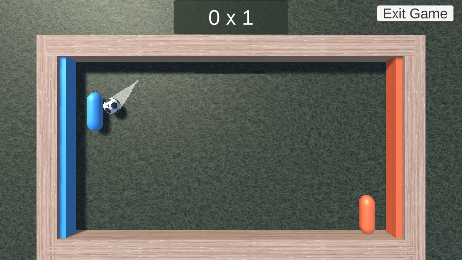

# Pong 

Pong is a simple game based on the classic arcade Pong, where players control paddles to bounce the ball and scores points.

## Gameplay

The objective of the game is to score more points than your oppenent by bouncing the ball with the paddles. The game can be played on the browser on the website [Unity Play](https://play.unity.com/mg/other/webgl-builds-383331).

## Screenshots

## How to Play

1. Access [this link](https://play.unity.com/mg/other/webgl-builds-383331).
2. Start the game.
3. Use the [W] and [S] keys to control the left paddle. 
4. Use the [↑] and [↓] keys to control the right paddle.

## System Requiriments

- **Web Browser**: It is recommended using Google Chrome, Mozilla Firefox, or Microsoft Edge for the best experience.

- **Internet Connection**: A stable internet connection is required to load and play the game

## Technologies Used

- **Unity:** Version 2022.1.11f1
  - Unity was the primary game development engine used for building and deploying the game.

- **Programming Languages:**
  - **C#:** Used for scripting and game logic.

- **Web Technologies:**
  - **HTML5 and WebGL:** The game is playable online using Unity WebGL technology.

- **Version Control:**
  - **Git:** Used for version control.

